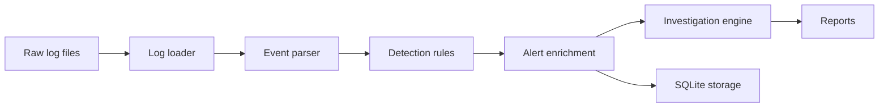

# Architecture

SentinelOps is organized as a small detection and investigation pipeline. Each stage has a narrow responsibility so the flow is easy to inspect, test, and extend.

## Components

| Component | Path | Responsibility |
| --- | --- | --- |
| Loader | `loader.py` | Reads raw log lines from disk |
| Parser | `parser/event_parser.py` | Converts raw logs into normalized event dictionaries |
| Detector | `detector/detector.py` | Applies detection rules and correlation logic |
| Alerts | `alerts/alert_engine.py` | Builds alert payloads and exports JSON |
| Enrichment | `enrichment/enricher.py` | Adds IP reputation, asset criticality, and MITRE context |
| Investigation | `investigation/investigator.py` | Produces findings, impact, risk, and recommendations |
| Reports | `reports/report_generator.py` | Generates incident reports, executive summary, and dashboard |
| Storage | `storage/sqlite_store.py` | Persists runs, alerts, and investigations in SQLite |

## Data Flow

1. A log file is loaded from `logs/`.
2. Each log line is parsed into a structured event.
3. Detection rules evaluate the normalized events.
4. Related detections are correlated when they share a source.
5. Alerts are enriched with additional context.
6. Each alert is investigated and written to reports.
7. Alerts and investigations are stored in SQLite unless disabled.

## Design Notes

- Detection thresholds and trusted IPs are configured outside the code.
- Generated artifacts are ignored by Git to keep the repository focused on source files and examples.
- The dashboard is static HTML, so it can be opened without a web server.
